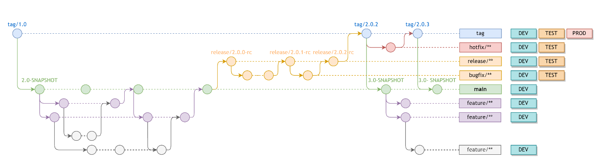

# Guideline Document

## Installation

### Nodejs

Node.js is a cross-platform, open-source server environment that can run on Windows, Linux, Unix, macOS, and more. Node.js is a back-end JavaScript runtime environment, runs on the V8 JavaScript Engine, and executes JavaScript code outside a web browser.

> Node v18.18.0: [Node.js](https://nodejs.org/en)

### Yarn package manager

Yarn, or Yet Another Resource Navigator, is a relatively new package manager developed by Facebook. It was developed to provide more advanced capabilities that NPM lacked at the time (such as version locking) while also making it safer, more reliable, and more efficient.

> Yarn v4.0.2: [Yarn](https://yarnpkg.com/getting-started/install)

### Git and Git tools

Git is a distributed version control system that tracks changes in any set of computer files, usually used for coordinating work among programmers collaboratively developing source code during software development. Its goals include speed, data integrity, and support for distributed, non-linear workflows (thousands of parallel branches running on different systems).

> Git [Git -Download](https://git-scm.com/downloads)

GIT Extensions is a distributed version control system enabling a user to robustly manage a collection of source files and the changes made in them. The changes made are shown in the History of changes. Users can make changes by accessing a Central repository called remote repository and committing the changes to it.

> Git extension [Git Extension](http://gitextensions.github.io/)

### VsCode Editor and Extension

Visual Studio Code, also commonly referred to as VS Code is a source-code editor made by Microsoft with the Electron Framework, for Windows, Linux and macOS. Features include support for debugging, syntax highlighting, intelligent code completion, snippets, code refactoring, and embedded Git. Users can change the theme, keyboard shortcuts, preferences, and install extensions that add functionality.

> Visual studio code [VS Code](https://code.visualstudio.com/download)

The recommend vscode extensions (check in .vscode/extensions.json):

```
"esbenp.prettier-vscode",
"streetsidesoftware.code-spell-checker",
"wix.vscode-import-cost",
"oderwat.indent-rainbow",
"formulahendry.auto-rename-tag",
"aaron-bond.better-comments",
"naumovs.color-highlight",
"eamodio.gitlens",
"Orta.vscode-jest",
"figma.figma-vscode-extension",
"SonarSource.sonarlint-vscode"
```

### Browser and extensions

Google Chrome is a cross-platform web browser developed by Google. It was first released in 2008 for Microsoft Windows, built with free software components from Apple WebKit and Mozilla Firefox.

Versions were later released for Linux, macOS, iOS, and also for Android, where it is the default browser. The browser is also the main component of ChromeOS, where it serves as the platform for web applications.

> Chrome [Chrome - Download](https://www.google.com/intl/en_us/chrome/)

Recommended extensions:

1. React Developer Tools
2. Redux DevTools
3. VisBug
4. Responsive Viewer

## Source code management

### Clone the source code

1. Login to source management system
2. Enable MFA
3. Create SSH credentials
4. Clone source

```bash
git clone <source_path>
```

### Git workflow

Follow this git workflow:


> The main branch is “main”. You don't have permission to push on this branch

### Branch name convention

When you do a task, please create a branch with these rules:

```
<type>/<task_id>-<task_name>
```

_Description:_

\<type>

| Branch type | Description                          | Can create by                  |
| ----------- | ------------------------------------ | ------------------------------ |
| main        | The base code branch                 | Devops                         |
| tag/        | The current production code version  | Team lead or Auto              |
| release/    | The code to commit for a release     | Team lead                      |
| hotfix/     | Fix a urgent bug on production       | Dev team (Review by team lead) |
| feature/    | Create a new feature for application | Dev                            |
| bugfix/     | Fix a bug                            | Dev                            |
| refactor/   | Refactor source code                 | Dev                            |

_\<task_id>_

The task's id should be a unique alphanumeric identifier associated with a particular task. It helps in easily identifying and referencing the task throughout the development process.

_Convention:_

1. User lowercase-hyphens-separate for task IDs
2. Keep the project prefix

_\<task_name>_

The task's name is a critical part of the branch naming convention, offering a brief but descriptive summary of the task being performed. It serves as a quick reference point for developers and team members to understand the purpose of the branch.

_Convention:_

1. User lowercase-hyphens-separate for task's name
2. Should include key information
3. Task-specific keywords: update, implement, fix

>

_Examples:_

```
    feature/ptn-789-implement-payment-gateway
    bugfix/ptn-234-resolve-fix-navigation-bug
    refactor/ptn-567-update-database-schema
```

### Commit convention

Follow this document for any commit [Conventional Commits](https://www.conventionalcommits.org/en/v1.0.0)

```
<type>[optional scope]: <description>

[optional body]

[optional footer(s)]
[optional Refs: <tas_ id_1>, <task_id_2>, …]
```

_example_

```
fix: prevent racing of requests

Introduce a request id and a reference to latest request. Dismiss
incoming responses other than from latest request.

Remove timeouts which were used to mitigate the racing issue but are
obsolete now.

Reviewed-by: Khan.Tran
Refs: AEEP-10 , AEPP-17
```

## Starting develop

### Config host file to custom local domain

Add one line to the host file

_Windows_

File location:

```
C:\Windows\System32\drivers\etc\hosts
```

```
127.0.0.1 local.domain.org.au
```

### ENV file

Fill the environment variable for .env file base on file .env.example

```
VITE_API_GW_URL=
VITE_AUTH0_CLIENT_ID=
VITE_AUTH0_DOMAIN=
VITE_AUTH0_AUDIENCE=
VITE_AUTH0_DOMAIN_WILDCARD=
```

### Install packages:

```bash
yarn install
```

### Start development

```bash
yarn start
```

### Build

```bash
yarn build
```

### Preview build

```bash
yarn preview
```

### Check ESLint

```bash
yarn lint
yarn lint:fix
```

### Run unit test

```bash
yarn test
yarn test:coverage
yarn test -- core/button/TriButton.test.tsx --coverage --collectCoverageFrom=src/components/core/button/TriButton.tsx
```

### Run Storybook

```bash
yarn storybook
yarn build-storybook
yarn chromatic
```

## Naming convention

### General

| Style                      | Category                                                                                       |
| -------------------------- | ---------------------------------------------------------------------------------------------- |
| camelCase                  | Variable (let/const), Parameter, Function, Method, Property of Class, Key of Object, Decorator |
| PascalCase                 | Class, Interface, Type, Enum, Namespace, Component, Key of Enum                                |
| CONSTANT_CASE              | Global constant values, Including enum values, Static readonly                                 |
| lowercase-hyphens-separate | Folder name, URL module                                                                        |

_Example_

```typescript
#camelCase
const exampleName;
let exampleName;
@decorator
const functionName = (parameterA:string, parameterB:number)=>{};

#PascalCase
class ClassName{
propertyA:string | null = null
};
interface FLButtonProps{
	color:string;
};
type Color  = string | number | “primary”;
enum Status{
	Active = “ACTIVE”
	Pending = “PENDING”
};
export const FLButton = ()=>{
	return <button />
};
namespace Validation {};

#CONSTANT_CASE
const MAX_WIDTH = 1024;
const ROUTES = {
	HOME: “/”
	CONTACT_DETAIL:”/contact/:id”
};
```

### Folder name

1. Must use “lowercase-hyphens-separate” for folder name
2. Use “\_underscore-first” for special folders: general page, dynamic param page (\_id, \_type, \_lang)

```
assets
conponents
core
fl-button
health-insurance
# general page
_404
 _403
 _error
# dynamic param page
/contact/:id  pages/contacts/_id/index.tsx
```

### URL

1. Must use “slash/lowercase-hyphens-separate” for the URL

```
http://example.com/api/patients
http://example.com/api/patients/152/contact-detai
```

2. Use Nouns, Not Verbs

```
❌ https://example.com/api/getPatients
✅ https://example.com/api/patients
```

3. Use Plural Nouns, Not Singular

```
❌ https://example.com/api/patient
✅ https://example.com/api/patients
```

4. Use colon symbol (:) for parameters

```
https://example.com/api/patients/:id
https://example.com/api/patients/:id/contact-detail
```

### Core Component

1. Use prefix Tri for the core component

```
@components/core/button/TriButton.tsx
<TriButton/>
```

### Layout Component

1. Use suffixes “Layout” for layout component

```
@components/layout/MainLayout.tsx
<MainLayout/>
```

### Page Component

1. Use suffixes “Page” for page component

```
@page/examples
<ExamplesPage/>

@page/examples/:id
<ExampleDetailPage/>
```

### Portal Component

1. Use suffixes “Placement” for the placement component
2. Use suffixes “Container” for the container component

```
@component/portals/page-name
<PageNamePlacement/>
<PageNameContainer/>

#use
<PageNameContainer>
	<Comp />
</PageNameContainer>
<PageNamePlacement />
```

### Component Props Interface

```typescript
export interface TriButtonProps{
	color:string
}
export const TriButton (props:TriButtonProps)=>{};
```

### Hook

1. Use prefix “use” for the hook

```
@hooks/core/useMap.ts
useMap()

@hooks/examples/index.ts
useExamples()
```

### HOCs

1. Use prefix “with” for the HOCs

```
@hocs/core/withAuth.ts
withAuth()
```

### Validation Function

1. Use suffixes “Resolver” for form validation resolver
2. Use prefix “validate” for boolean check functions
3. Use prefix “check” for check function, that not return boolean

```typescript
export const contactResolver = Yup.object();

export const validateEmail = (email: string): boolean => {};
//return true/false
export const checkEmail = (email: string): string | null => {};
//return message
```

### Service function

1. Use prefix is the method of the service

```typescript
export const getPatients = async () => {}; //Get all patients
export const getPatient = async () => {}; //Get one patient
export const postPatient = async () => {}; //Create a patient
export const putPatient = async () => {}; //Update a patient
export const patchPatientStatus = async () => {}; //Update a patient’s status
export const deletePatient = async () => {}; //Delete a patient
```

### Handle functions

1. Use prefix “handle” for handle functions

```typescript
const handleSubmit = () => {};
const handleDelete = () => {};
const handleClick = () => {};
```

### Function Props

1. Use prefix “on” for functions in the props

```typescript
interface ToggleButtonProps {
  onClick: (event: Event) => void;
  onDrag: (event: Event) => void;
}

<ToggleButton onClick={handleClick} onDrag={handleDrag} />;
```

### Boolean Variables

1. Affirmative Naming: Use positive and affirmative names that indicate the true or active state of the variable
2. Prefixes: Consider using prefixes that imply a boolean nature. This makes it clear that the variable represents a true/false condition
3. Camel Case
4. Stateful Naming: For boolean variables that represent the state of a component or a specific feature, consider including the term "state" in the name

_Example_

```typescript
// Affirmative Naming
const isVisible = true;
const hasPermission = false;

// Prefixes
const isLoading = true;
const canEdit = false;

// Stateful Naming
const isModalOpen = true;
const hasServerError = false;
```

### Boolean Props

1. The same with boolean variables
2. If the default behavior of the component or feature is true, consider naming the prop without a prefix.

```typescript
<ToggleButton active />
<ToggleButton open />
<ToggleButton enabled />
<ToggleButton editable />
<ToggleButton loading={isLoading} />
<Checkbox checked={false} />
<Checkbox hasError={false} />
```

## References

### Base

- [React](https://react.dev/)
- [Commit convention](https://www.conventionalcommits.org/en/v1.0.0)
- [Google Typescript Guide](https://google.github.io/styleguide/tsguide.html)
- [Typescript Docs](https://www.typescriptlang.org/docs/)
- [Typescript Cheat Sheets](https://www.typescriptlang.org/cheatsheets)

### Libraries

- [Vite](https://vitejs.dev/)
- [Jest + React testing lib](https://jestjs.io/docs/tutorial-react)
- [Storybook](https://storybook.js.org/docs/react/get-started/install/)
- [React router 6](https://reactrouter.com/en/main)
- [React query](https://tanstack.com/query/v3/)
- [Redux + Toolkit](https://redux-toolkit.js.org/)
- [Axios](https://axios-http.com/)
- [React hook form](https://react-hook-form.com/)
- [Yup](https://github.com/jquense/yup)
- [Lodash](https://lodash.com/)
- [React use](https://github.com/streamich/react-use)
- [Prettier](https://prettier.io/docs/en/index.html)
